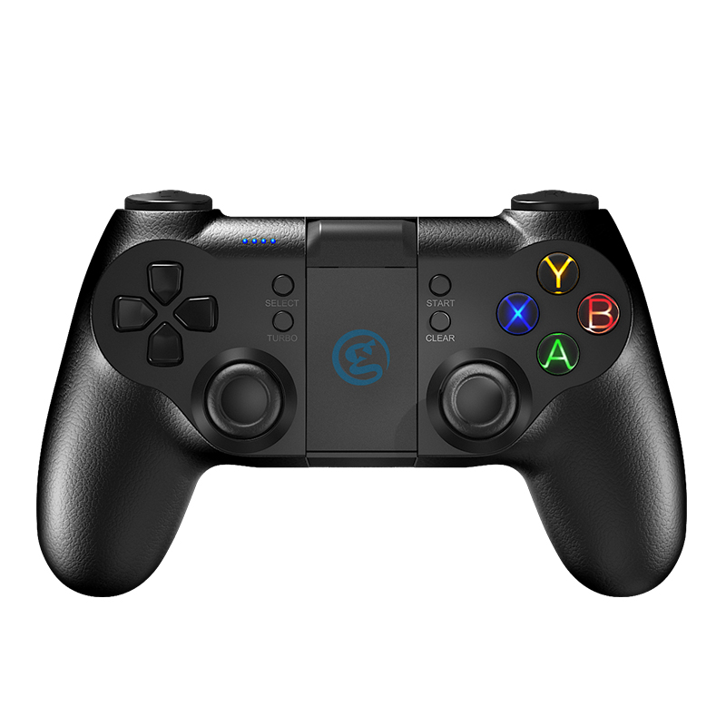

1.买手柄
============================

Tello是支持手柄控制的，在大疆DJI的销售官网上，可以看到配有 **盖世小鸡 GameSir T1d遥控器** 出售，买了它，就可以配合Tello进行飞行了。
 **但是** 按照官方说明， *Gamesir T1d控制器仅可搭配Tello飞行器使用，是专为无人机飞行定制的控制器，非游戏操作使用。* 
买的这个手柄，只能给Tello使用。

如果，你想，买个手柄，既可以操控Tello，又可以用来打游戏，那么 **盖世小鸡 GameSir T1s遥控器** 是你不二的选择。
到 Gamesir的官方网址或者京东等购买，然后一样可以连接到Tello的App，同时，需要的时候还可以切换到游戏机手柄模式打游戏。
笔者就是使用的T1s版，而不是T1d版。

------------------
T1d的特性：
------------------

概述
    控制手柄可以将手机变成一台无人机控制器，用轻奢级的手感、流畅的体验和便捷的操作重新定位无人机的控制器。通过2个高精度3D摇杆，无死角指向任何地方，可以做出更多高难度的操作。控制手柄通过GCM连接模式（GameSir Connecting Mode）高速连接，无需等待，上手即玩。
亮点
    * 轻奢级仿皮质手感
    * 高精度无死角摇杆
    * GCM高速连接
包装清单
    * 盖世小鸡 GameSir T1d遥控器 ×1
    * 说明书 ×1
    * 合格证 ×1
技术参数
    * 支持平台：iOS 7.0 以上、安卓4.0以上
    * 蓝牙版本：BLE 4.0
    * 充电电压：3.7V-5.2V
    * 工作温度：0°C至40°C
    * 工作湿度：20-80％
    * 工作距离：7m
    * 电池容量：600 mAh
适配产品
    * 特洛 Tello

------------------
T1s的额外特性：
------------------

除了T1d的各项特性以外，

    * 有2.4G连接方式，可以直接连接智能电视，电脑，PS3等设备。
    * 蓝牙连接安卓端和苹果IOS端，支持不限于龙之谷，王者荣耀等游戏。
    * 有安卓标准 / 苹果iOS / 模拟鼠标GCM / PS3 / Xinput Dinput等工作模式

无论是T1d还是T1s，长相都一样，如图：

